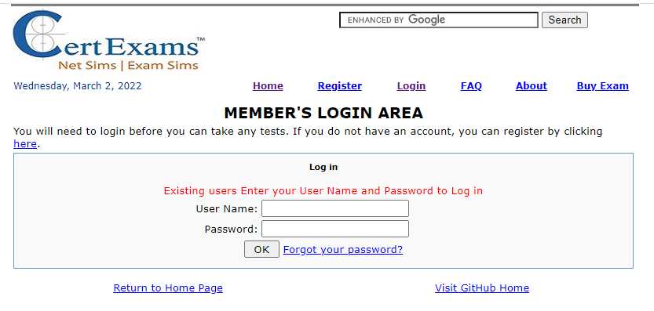

<!-- Project Title -->
# Web Based Online Exams
## Project Summary:
<!-- A little brief about what the project is about. It should be like a small summary format informing about the main purpose of the project. -->
The intention is to make online exam available using PHP/MySQL Apache web server. The scripts are commented as necessary, but feel free to update the same. One can install the scripts, and configure the same appropriately, after which, it is possible to create, populate, and deliver the exams over the Internet. The user just needs to login to take the exam(s)

# Table of contents

- [Background](#background)
- [Build Status](#Build-Status)
- [Code Style](#Code-Style)
- [Screenshots](#Given-below-are-a-few-screenshots-as-it-is-now)
- [Tech/Framework used](#Tech-Framework-used)
- [Features](#Features)
- [Installation](#Installation)
- [How to Use?](#How-to-Use)
- [Contribute](#Contribute)
- [License](#License)

 ### Background 
<!--- This section is for letting the reader know why you created this project, the reason behind pursuing such a project, and why you have decided to do it.
-->
It is the intention of the founding members to make free online exam scripts available to the public without any hassles and one can have an exam delivery platform of one's own using LAMP environment.

### Build Status

<!--  This basically explains the current build status of the project. If there is a bug /error which needs addressing. This is done so for two different reasons The user understands that this is an issue and does not spend more time figuring if it was a mistake on their part.A developer who is familiar with the issue can suggest some solutions directly without going through the whole code. -->

The package is fully functional according to the current version. However, there is huge scope for improvement and additional contribution is welcome! 

### Code Style
<!-- This lets the users know that you have used a particular code style and helps them when contributing to your project so that the whole project code style stays the same. Some common code styles: standard, xo, etc. -->

The entire project uses html, Javascript, PHP, Perl, MySQL, and xml. Therefore, contributers need to be familiar with these scripting languages to write any code. 

### Given below are a few screenshots as it is now
<!-- As the saying goes, a picture is equal to a thousand words. Most people will be interested if there is a visual representation of what the project is about. It helps them understand better. A visual representation can be snapshots of the project or a video of the functioning of the project.
-->
Given below is the login screen (the login is same for user as well as the exam admin. However, admins will have more privileges like creating authors.
  

 
Given below is the User dashboard that displays a left pane and a right pane. The left pane enables users to change password, view profile, etc.
 

 
There are two modes of exam, one is Learn mode and the other is Exam mode.
 

 
Given below shows a typical exhibit based question:
 

 
This screenshot shows "Question Review":
 

 
This following screen shot shows Review Screen of the exam being taken by the user: 

 
This shows the Review Summary after completion of exam by the user: 

 
Score report screen is shown below for a typical exam taken by a user: 

 
Test screen is shown below where the question being answered by a user is shown: 

 
The following picture shows the User Profile:

 
### Tech-Framework used
<!-- This is used to help the reader understand which tech or frameworks have been used to do the project. It helps the reader understand which all tech stack he has to be familiar with to understand the whole project. -->

The code is entirely developed using notepad (text editor) and no content development software is used. Basically, one just needs a text editor for code changes or development. A picture editor would be required for editing images. Note that the content depends on the question base and the type of questions. It has nothing to do with the exam software itself.

### Features
<!-- This is where you write what all extra features have been done in your project. Basically this is where you try to make your project stand out from the rest. -->

- Simple interface which is intuitive to the user
- Very widely used LAMP environment, where one need not buy any software for making changes or improving the features.
- Learn and exam modes so that users can change between these modes depending on the need
- Scope for improvement
-- there is scope for improving the statistics reporting.

<!--  ### Code Examples
This is where you try to compress your project and make the reader understand what it does as simply as possible. This should help the reader understand if your code solves their issue. -->

### Installation
<!-- If your project needs installation of certain software or configurations to the system. Do mention it in this section as it helps a lot for the reader to use your project. The steps mentioned should be precise and explanatory.  If possible, you can add links that can help them better understand how to configure/install the necessary files or softwares. -->
The installation is manual. You need to manually create the required database and give permissions. 
The code can be downloaded as a zip file from the repository. Create a MySQL database on your server, as well as a database user with full access and modification rights to the database. 
Import the file "sql-statements-online.sql" into your MYSQL database. It will create all of the necessary tables. 
Update the config.inc file to add the database name, database user, and password that were generated earlier. Set login and passwords as specified below: 
***********
$datahost = "localhost";  
$datauser = "database_user";  
$datapasswd = "database_pwd"; 
$base = "database_name"; 
***********
The code modules need to be uploaded using FTP as specified in the document and give appropriate permissions for each file/directory.
<!-- ### API reference
 If your project is small, then we can add the reference docs in the readme. For larger projects, it is better to provide links to where the API reference documentation is documented. -->

<!-- ### Tests
 This is the section where you mention all the different tests that can be performed with code examples -->

### How to Use
<!-- As I have mentioned before, you never know who is going to read your readme. So it is better to provide information on how to use your project. A step-by-step guide is best suited for this purpose. It is better to explain steps as detailed as possible because it might be a beginner who is reading it. -->
 There are 3 categories of users:
 - Administrators
 - Authors
 - Registered Users

### Contribute
<!-- This is where you let them know that they can contribute and help you out. A guideline on how to contribute is also helpful -->
 The code is still in infancy and lot of features and refinements could be added.

<!-- ### Credits
Giving proper credit is most important. Mention any links/repos which helped you or inspired you to build this project. It can be a blog, another open source project, or just people who have contributed in building this project. -->

### License
<!-- A short description of the license. (MIT, Apache, etc.) -->
The code is under Open Source software license. Individuals may use the code without any permission. Organizational users need to take the permission to use the software.

- Source website: [Certexams.com](https://www.certexams.com)
- View the demo site by logging on to [online.certexams.com](https://online.certexams.com/index.html)
- Help with editing, check this resource: #### https://docs.github.com/en/get-started/writing-on-github/getting-started-with-writing-and-formatting-on-github/basic-writing-and-formatting-syntax
<!-- - Provides scrips for conducting online exams. -->

